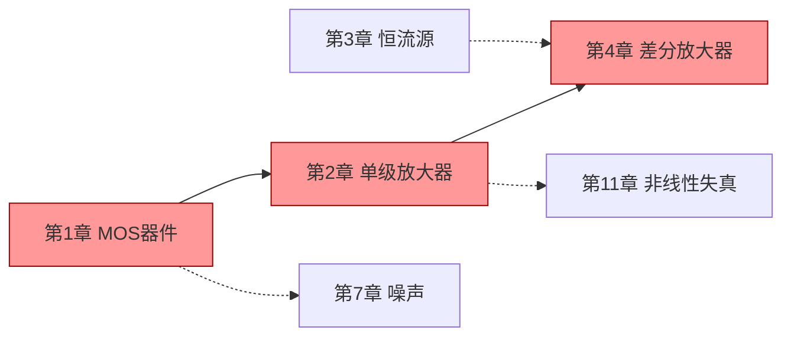

# 输出文档模板规范

每章一个目录，固定 5 类文件。**不要增减文件数量**——主人形成肌肉记忆后能快速跳转。

## 模板文件参考

实际模板在 `templates/` 目录下，包含占位符 `{{xxx}}`。

| 文件 | 模板 | 用途 |
|------|------|------|
| 01_考点清单 | [keypoints.md](../templates/keypoints.md) | 该章考什么 |
| 02_例题精讲 | [examples.md](../templates/examples.md) | 老师指定例题 + 真题对应例题 |
| 03_公式手卡 | [formulas.md](../templates/formulas.md) | 考场对照速查 |
| 04_真题映射 | [exam-mapping.md](../templates/exam-mapping.md) | 真题 → 考点 → 例题 |
| 05_自测 | [self-test.md](../templates/self-test.md) | 隐藏答案的练习 |

---

## 占位符约定

| 占位符 | 含义 | 示例 |
|--------|------|------|
| `{{科目}}` | 课程名 | "模拟集成电路" |
| `{{章号}}` | 章节编号 | "1" |
| `{{章节名}}` | 章节标题 | "MOS 器件" |
| `{{考点}}` | 具体考点 | "沟道长度调制效应" |
| `{{星级}}` | 重要性 | `★★★` / `★★` / `★` |
| `{{真题ID}}` | 真题题目 ID | "2024B-单选-3" |
| `{{页码}}` | 课本页 | "P55" |

---

## 双链规范

使用 Obsidian 双链建立交叉引用：

```markdown
本考点对应真题 [[04_真题映射#2024B-计算-1]]，详细解法见 [[02_例题精讲#例2.7]]。
```

**链接命名规则**：
- 文件名：`01_考点清单`、`02_例题精讲`...（前缀数字保证排序）
- 章节锚点：用 Obsidian 自动生成的 heading slug（即 # 后的原文，空格转换为 -）

---

## Mermaid 图标准

`00_总索引.md` 必含一张章节关系图：



- 实线箭头：知识依赖
- 虚线箭头：在该章中被复用
- 红色填充：★★★ 必考章节

---

## 答案折叠规范

`05_自测.md` 中的答案必须用 Obsidian Callout 折叠：

```markdown
## 自测 1

题目：求图 1 共栅放大器的小信号电压增益。

> [!faq]- 点击展开答案
> 
> **答案**：$A_v = g_m R_D$
> 
> **解析**：
> 1. 画交流小信号等效电路...
> 2. ...
```

- `[!faq]` 之后必须有 `-`（折叠默认收起）
- 不要用 `<details>` HTML 标签，Obsidian 默认不解析

---

## 公式渲染

- 行内：`$g_m = \mu_n C_{ox} \frac{W}{L} V_{ov}$`
- 块级：`$$ ... $$`
- KaTeX 不支持的 LaTeX 命令（如 `\cancel`）→ 用文字描述
- 矩阵/对齐：用 `\begin{aligned} ... \end{aligned}` 而非 `\begin{align}`

---

## 表格规范

- 每张表必有表头分隔行
- 列数 ≤ 5（移动端可读）
- 公式列允许超长，其他列简洁

---

## 文件命名

```
{输出目录}/
├── 00_总索引.md
├── 01_第1章_MOS器件/
│   ├── 01_考点清单.md
│   ├── 02_例题精讲.md
│   ├── 03_公式手卡.md
│   ├── 04_真题映射.md
│   ├── 05_自测.md
│   └── _figures/              ← 本章关键电路图（PNG）
│       ├── fig_电路拓扑_xxx.png
│       ├── fig_小信号_xxx.png
│       └── fig_特性曲线_xxx.png
├── 02_第2章_单级放大器/
│   └── ...
└── _extracted/        ← 中间产物（PPT/Word转md），不放最终文档
```

**命名规则**：
- 章节目录前缀使用**课本原始章号**（如 01、02、04、07、11），非连续序号——方便和教材对照
- 格式：`{课本章号两位}_第{N}章_{标题}`（如 `07_第7章_噪声`）
- 不用空格，用下划线
- 不用 emoji（污染 Obsidian 大纲）
