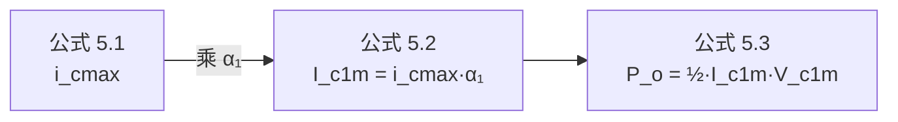

# 公式手卡生成 Prompt（高质量增强版）

> 此文件供 exam-cram-review skill 的 03_公式手卡.md 子代理任务复用。
> **核心原则**：parser.js 通过加粗段格式提取 `meaning / condition / derivation / application`，
> 通过 H2 标题词识别 `importance`，通过文本中的 "公式 N.M" 引用自动构建 `related`。
> 因此子代理必须严格遵守下面的输出模板，否则 webapp 公式卡、Anki 模式将无法展示这些字段。

---

## 强制输出格式

每条主要公式按下面**完整结构**输出（不可省略字段；无内容则写 "—"）：

```markdown
## {{公式名}}（公式 {{章号.序号}}，{{必背|熟悉|了解}}）

$$ {{LaTeX 公式}} $$

**物理含义**：用 1-2 句话说清楚此公式表达的物理图像。例：`描述基极电压改变导致基波集电极电流的线性关系，是丙类功放计算的入口。`

**适用条件**：例：`饱和区 / 单频信号 / 高 Q 值近似`

**推导起点**：从 公式 {{N.M}} 对 {{某变量}} 求导推得，或由 {{萨氏方程 / 大信号方程 / 谐振条件 / 其他}} 推出。 *— 务必含 "公式 N.M" 字样，parser 据此自动连接关联*

**应用场景**：
- {{典型应用 1，含真题题号或例题号}}
- {{典型应用 2}}

**关联公式**：见 公式 {{N.M+1}}、公式 {{N.M+2}}。*— 凡跨公式引用都用 "公式 N.M" 句式*

---
```

## 关键规则

1. **重要级标注**（必填 H2 括号内任选一个）：
   - `必背` → webapp 渲染红色徽章；仅给真题大题/选择填空高频考点
   - `熟悉` → 橙色徽章；老师指定重点
   - `了解` → 灰色徽章；外围知识
   - 默认不填（蓝色徽章）

2. **公式编号**：使用「章号.序号」，如第 5 章为 5.1, 5.2, 5.3 ...，**不要**用书本原书的章节式编号。

3. **关联引用**：parser 用正则 `公式\s*\d+\.\d+` 提取关联，因此引用必须写成 `公式 N.M` 或 `公式N.M`（中间可有/无空格），不要写"公式（N.M）"或"式 N.M"。

4. **物理含义**：必填，1-2 句。Anki 模式背诵时这是关键线索。

5. **推导起点**：尽量含上游公式编号（如 `由 公式 5.1 求导得到`），使 webapp 关联高亮能跑通——这是 Gemini 前端"上游橙/下游绿发光"的依赖。

6. **应用场景**：至少 1 条，最好关联到真题题号。

---

## 章节末尾的附加结构（可选但推荐）

### 推导关系图（Mermaid，可选）



### 速查表（次要公式）

| 公式名 | 公式 | 条件 | 备注 |
|--------|------|------|------|
| ... | ... | ... | ... |

---

## 子代理调用示例

```
请按 ~/.claude/skills/exam-cram-review/templates/formula-gen-prompt.md 中规定的输出格式重写
D:/Download/高频/ai复习/05_第5章_高频功率放大器/03_公式手卡.md：

1. Read 当前文件，提取已有公式清单
2. 给每条公式补充缺失字段（物理含义/推导起点/应用场景）
3. 转换标题为「## 公式名（公式 5.N，重要级）」格式
4. 关联用 "公式 5.M" 句式引用

保留原有的公式 LaTeX 不要改。重要级判定基于该章节真题考查频次：必出大题相关 → 必背。
```

---

## 自检清单（生成完毕后子代理须自查）

- [ ] 每条公式标题含 `（公式 N.M，必背|熟悉|了解）` 三段
- [ ] 每条公式有 `**物理含义**：` 加粗段
- [ ] 每条公式有 `**应用场景**：` 加粗段
- [ ] 至少 60% 公式有 `**推导起点**：` 段且含 "公式 N.M" 引用
- [ ] 公式 LaTeX 用 `$$ ... $$` 块包裹
- [ ] 没有遗留旧格式（如 `- **重要级**：必背` 这种列表式）
