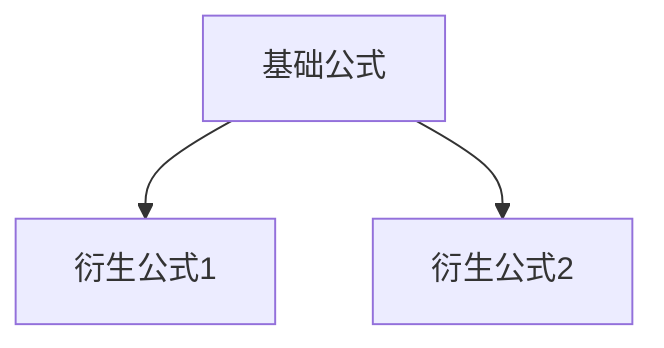

# 第{{章号}}章 {{章节名}} · 公式手卡

> 用途：考场对照速查
> 原则：高密度、零废话、按使用频率排序

---

## 核心公式

| # | 公式 | 适用条件 | 备注 |
|---|------|----------|------|
| {{N.1}} | $${{公式LaTeX}}$$ | {{条件}} | {{速记口诀}} |

---

## 推导关系图

---

## 单位与典型值

| 量 | 符号 | 单位 | 典型值 |
|----|------|------|--------|
| {{量}} | {{符号}} | {{单位}} | {{典型值}} |

---

## 常见替换/简化

| 原始公式 | 简化条件 | 简化形式 |
|---------|---------|---------|
| {{原}} | {{条件}} | {{简}} |

---

## 与其他章节的公式联系

- 本章 {{公式}} → 第 {{N+1}} 章 {{应用场景}}
